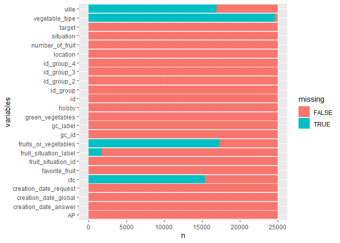

Tests Data-Scientist – Multi-classification
================

-   [**Preambule**](#preambule)
-   [Bibliothèques](#bibliothèques)
-   [**Analyse Exploratoire des
    données**](#analyse-exploratoire-des-données)
    -   [Lecture de données](#lecture-de-données)
    -   [Doublons et valeurs uniques](#doublons-et-valeurs-uniques)
    -   [Valeurs manquantes](#valeurs-manquantes)
    -   [Analyse univariée de la variable
        d’interêt](#analyse-univariée-de-la-variable-dinterêt)
    -   [Analyse bivariée](#analyse-bivariée)
    -   [Mécanisme des valeurs
        manquantes](#mécanisme-des-valeurs-manquantes)
        -   [Graphiques](#graphiques)
        -   [Modélisation explicative](#modélisation-explicative)
-   [**Features Engineering**](#features-engineering)
-   [**Modélisation prédictive**](#modélisation-prédictive)
    -   [Partitionnement des données](#partitionnement-des-données)
    -   [Récherche du meilleur modèle](#récherche-du-meilleur-modèle)
        -   [Les modèles d’arbres : robustes aux valeurs
            manquantes](#les-modèles-darbres--robustes-aux-valeurs-manquantes)
        -   [Bagging](#bagging)
        -   [Modèle linéaire : Regression
            logistique](#modèle-linéaire--regression-logistique)
-   [**Prédictions**](#prédictions)

<br/>

# **Preambule**

Dans ce travail de modélisation prédictive, j’ essayerai de tester
plusieurs modèles  
predictifs afin de trouver le meilleur modèle. Il s’agit d’un problème
d’apprentissage supervisé!

Successivement, j’évaluerai les performances des modèles suivants :

**modèles linéaires** seront appliqués (Logistique et LDA ),

**modèles non linéaireS** (Essentiellement les arbres),

**modèles d’ensemble** (Bagging ou Random Forest),

# Bibliothèques

``` r
#Manipulation des données
library(data.table) 
library(tidyverse)
```

    ## -- Attaching packages --------------------------------------- tidyverse 1.3.1 --

    ## v ggplot2 3.3.5     v purrr   0.3.4
    ## v tibble  3.1.6     v dplyr   1.0.7
    ## v tidyr   1.1.4     v stringr 1.4.0
    ## v readr   2.1.0     v forcats 0.5.1

    ## -- Conflicts ------------------------------------------ tidyverse_conflicts() --
    ## x dplyr::between()   masks data.table::between()
    ## x dplyr::filter()    masks stats::filter()
    ## x dplyr::first()     masks data.table::first()
    ## x dplyr::lag()       masks stats::lag()
    ## x dplyr::last()      masks data.table::last()
    ## x purrr::transpose() masks data.table::transpose()

``` r
# graphiques
library(ggplot2)
library(scales)
```

    ## 
    ## Attachement du package : 'scales'

    ## L'objet suivant est masqué depuis 'package:purrr':
    ## 
    ##     discard

    ## L'objet suivant est masqué depuis 'package:readr':
    ## 
    ##     col_factor

``` r
library(ggpubr)
#Machine learning et Modélation statistque
library(C50)  
library(caret)
```

    ## Le chargement a nécessité le package : lattice

    ## 
    ## Attachement du package : 'caret'

    ## L'objet suivant est masqué depuis 'package:purrr':
    ## 
    ##     lift

``` r
library(rpart) # (Reursive PARTitioning) 
library(rpart.plot)
library(MASS) 
```

    ## 
    ## Attachement du package : 'MASS'

    ## L'objet suivant est masqué depuis 'package:dplyr':
    ## 
    ##     select

``` r
library(adabag)  # modèle d'ensemble
```

    ## Le chargement a nécessité le package : foreach

    ## 
    ## Attachement du package : 'foreach'

    ## Les objets suivants sont masqués depuis 'package:purrr':
    ## 
    ##     accumulate, when

    ## Le chargement a nécessité le package : doParallel

    ## Le chargement a nécessité le package : iterators

    ## Le chargement a nécessité le package : parallel

``` r
library(VGAM) #regression logiistique multinomiale
```

    ## Le chargement a nécessité le package : stats4

    ## Le chargement a nécessité le package : splines

    ## 
    ## Attachement du package : 'VGAM'

    ## L'objet suivant est masqué depuis 'package:caret':
    ## 
    ##     predictors

    ## L'objet suivant est masqué depuis 'package:tidyr':
    ## 
    ##     fill

# **Analyse Exploratoire des données**

## Lecture de données

``` r
path="C:/Users/u32118508/Downloads/train.csv"
train.sample<-fread(path,sep=",",encoding="UTF-8", na.strings=c("NULL",""))
head(train.sample)
```

    ##               id AP creation_date_answer situation  ctc location gc_id gc_label
    ## 1: a46cfa61ea20a  f  2019-03-13 11:14:42        -1 <NA>       52    70        G
    ## 2: c3d0cb8f0c5e2  f  2019-03-21 14:27:32        -1 <NA>       78    10        A
    ## 3: 05dfbe0ec3a8b  f  2019-03-15 17:49:50        -1 <NA>       70    10        A
    ## 4: 952e869ee1076  f  2019-01-07 08:19:29        -1    f       84    10        A
    ## 5: 5bd0e71b1395b  f  2019-02-03 17:57:22        -1 <NA>       29    20        D
    ## 6: d68831bf79cde  f  2019-03-20 12:54:00        -1 <NA>       32    10        A
    ##    creation_date_global      id_group    id_group_2 favorite_fruit
    ## 1:  2019-01-17 10:50:57 2d7e206d46ea1 36bac09400660          poire
    ## 2:  2018-08-20 05:57:51 35e96d6848871 80a697d593706     clementine
    ## 3:  2018-12-20 13:45:51 ffaf8085e383d c309176b96268     clementine
    ## 4:  2018-07-21 10:28:49 5360cf0a40ce3 13c1a3597648b     clementine
    ## 5:  2018-12-07 19:59:26 126c3211f23fc 7b68e0a456571     clementine
    ## 6:  2019-03-18 15:21:12 66ee828c029a1 29a97ceeb53c2     clementine
    ##    fruit_situation_id fruit_situation_label fruits_or_vegetables
    ## 1:                120                   jzy                 <NA>
    ## 2:                 10                    ae                 <NA>
    ## 3:                200                    ag                 <NA>
    ## 4:                 10                    ae                 <NA>
    ## 5:                 10                    ae                 <NA>
    ## 6:                200                    ag                 <NA>
    ##    number_of_fruit    id_group_3 creation_date_request    hobby    id_group_4
    ## 1:              -1 812a43d710ace   2019-03-13 11:14:42 football aa8f4934a31eb
    ## 2:              -1 4b59257f24573   2019-03-21 14:27:32 football 6ff9ea9ec85fd
    ## 3:              -1 f1a838f0d194b   2019-03-15 17:49:50 football 6a49a0a97b049
    ## 4:               0 c3196847d1c14   2019-01-07 08:19:29 football d0dcf1ca1bf04
    ## 5:              -1 70e18c6fe58cd   2019-02-03 17:57:22 football b4870b1c8eb42
    ## 6:              -1 ad2af49523d6f   2019-03-20 12:54:00 football 6222cd523cb49
    ##    ville green_vegetables vegetable_type target
    ## 1:  <NA>                f           <NA>      0
    ## 2:  <NA>                f           <NA>      1
    ## 3:  <NA>                f           <NA>      0
    ## 4:  <NA>                f           <NA>      1
    ## 5:  <NA>                f           <NA>      1
    ## 6:  <NA>                f           <NA>      0

Les variables comme id, id_group1, id_group2, id_group2, id_group3 et
id_group4 ne sont pas importantes à expliquer la variable target. La
colonne AP n’est pas à retenir car elle est constante sur toutes les
lignes.

gc_id et gc_label contiennent la meme information (l’une id et l’autre
le label). Nous ne retiendrons que la variable gc_label. Il est en de
même pour le couple de variable fruit_situation_id et
fruit_situation_label. Fruit_situation_label sera retenu pour la suite.

## Doublons et valeurs uniques

``` r
dim(train.sample)[1] - dim(unique(train.sample))[1]
```

    ## [1] 0

Il n’existe pas de doublon parfait dans le dataset,

``` r
dim(distinct(train.sample, id))
```

    ## [1] 25000     1

La colonne id est celle qui définie chaque ligne de données car elle est
unqiue pour chaque ligne.

``` r
dim(distinct(train.sample, id_group))[1]
```

    ## [1] 15844

``` r
dim(distinct(train.sample, id_group_2))[1]
```

    ## [1] 15675

Les colones id_group 1, 2, 3 et 4 ne sont pas uniques.

## Valeurs manquantes

``` r
train.sample  %>%
  summarise_all(list(~is.na(.)))%>%
  pivot_longer(everything(),
               names_to = "variables", values_to="missing") %>%
  count(variables, missing) %>%
  ggplot(aes(y=variables,x=n,fill=missing))+
  geom_col()
```

<!-- -->

Des variables comme fruits_or_vegetables ou ctc possèdent beaucoup de
variables manquantes, Fruit_label_situation également avec rélativement
peu de valeurs manquantes.

Les variables villes et vegetables types sont manquantes dans la plupart
des cas.

**Que faire ?**

Une solution ici serait de traiter les valeurs manquantes avant toute
modélisation des scores.

En effet, la taille des valeurs manquantes est tellement importante que
nous ne pouvons pas pas supprimer les lignes concernés ni faire une
imputation simple par moyenne ou mediane. Nous proposons alors de
chercher des liens existents entres les variables .

``` r
temp=train.sample  %>%
  filter(ville!='NA') %>%
  dplyr::select(c('ville','location')) %>%
  unique()

temp=temp[order(ville)]

head(temp,30)
```

    ##                   ville location
    ##  1:           Abbeville       81
    ##  2:             Achères       79
    ##  3:     Aire-sur-la-Lys       63
    ##  4:     Aix-en-Provence       13
    ##  5:     Aix-en-Provence       84
    ##  6:       Aix-les-Bains       25
    ##  7:         Alfortville       95
    ##  8:            Algrange       58
    ##  9:              Amiens       81
    ## 10:             Andrésy       79
    ## 11: Andrézieux-Bouthéon       43
    ## 12:              Angers       58
    ## 13:              Angers       50
    ## 14:           Angoulême       16
    ## 15:           Angoulême       24
    ## 16:           Angoulême       12
    ## 17:           Angoulême       41
    ## 18:           Angoulême       34
    ## 19:             Apprieu       39
    ## 20:             Arcueil       95
    ## 21:          Argenteuil       96
    ## 22:          Argenteuil       78
    ## 23:          Argenteuil       94
    ## 24:          Arnouville       96
    ## 25:             Arpajon       92
    ## 26:              Arques       63
    ## 27:     Ars-sur-Moselle       58
    ## 28:  Asnières-sur-Seine       93
    ## 29:  Asnières-sur-Seine       95
    ## 30:             Assérac       45
    ##                   ville location

Des villes comme Angoulême ,Angers Aix-en-Provence possèdent plusieurs
“locations” (j’ai fais l’hypothèse que ce sont location = departements
et cela a été infirmées après verification). Dans la locaton n ’est pas
unique pour une ville données, donc je ne peux faire jointure adéquate
afin d’imputer les valeurs manquantes de villes. Pas de stratégie
d’imputation de la variables ville.

## Analyse univariée de la variable d’interêt

``` r
ggplot(data = train.sample, aes(x = target ,y = (..count..)/sum(..count..)*100)) +
    geom_bar()+
    labs(y = 'pourcentage', title="Repartition de la variable d'interêt ")
```

<!-- -->
Les classes sont très déséquiibrées.Ce graphique met en evidence la
raison de l’indicateur “weighted loss” afin de donner plus d’importance
à la prediction des modalités peu fréquentes.

<br/>

En réalité les variables number_of_fruits, situation, target, doivent
etre déclarées catégorielles.

``` r
train.sample$target=as.factor(train.sample$target)
train.sample$number_of_fruit=as.factor(train.sample$number_of_fruit)
train.sample$situation=as.factor(train.sample$situation)
train.sample$green_vegetables =as.factor(train.sample$green_vegetables)
train.sample$fruits_or_vegetables =as.factor(train.sample$fruits_or_vegetables)
train.sample$ctc  =as.factor(train.sample$ctc)
train.sample$hobby  =as.factor(train.sample$hobby)
train.sample$gc_label  =as.factor(train.sample$gc_label)
train.sample$ville  =as.factor(train.sample$ville)
train.sample$favorite_fruit  =as.factor(train.sample$favorite_fruit)
train.sample$fruit_situation_label  =as.factor(train.sample$fruit_situation_label)
train.sample$vegetable_type  =as.factor(train.sample$vegetable_type)
```

<br/>

## Analyse bivariée

``` r
p1<-ggplot(data = train.sample, aes(x = factor(number_of_fruit) ,y = (..count..)/sum(..count..)*100)) +
    geom_bar()+
    labs(y = 'pourcentage', x= 'number_of_fruit', title="Number_of_fruit ")

p2<-ggplot(data=train.sample, aes(x=target, fill=factor(number_of_fruit))) +
  geom_bar(position="fill")+
  labs(fill='number_of_fruit',y = 'pourcentage', title="number_of_fruit VS target ")

p3<-ggplot(data = train.sample, aes(x = situation ,y = (..count..)/sum(..count..)*100)) +
    geom_bar()+
    labs(y = 'pourcentage', x= 'sitation', title="Situation ")

p4<-ggplot(data=train.sample, aes(x=target, fill=situation)) +
  geom_bar(position="fill")+
  labs(fill='situation',y = 'pourcentage', title="situation VS target ")


ggarrange(p1,p2, p3,p4,  ncol = 2, nrow = 2)
```

<!-- -->

Les modalités nombre de fruits 1, 2 ,3 , 4 et 5 sont très peu
representées (rares).

Néanmoins, il est ressort du graphique de droite que les modalités 2 et
1 fruits semblent caractériser le mieux le target 3 suivi du target 2.

La variable situation est également une variable explicative potentielle
au régard de la liaison que l’on peut apercevoir sur le graphique. <br/>

``` r
p1<-ggplot(data = train.sample, aes(x = green_vegetables ,y = (..count..)/sum(..count..)*100)) +
    geom_bar()+
    labs(y = 'pourcentage', x= 'Type of green_vegetables', title="green_vegetables ")

p2<-ggplot(data=train.sample, aes(x=target, fill=green_vegetables)) +
  geom_bar(position="fill")+
  labs(fill='green_vegetables',y = 'pourcentage', title="green_vegetables VS target ")

p3<-ggplot(data = train.sample, aes(x = hobby,y = (..count..)/sum(..count..)*100)) +
    geom_bar()+
    labs(y = 'pourcentage', x= 'Type of hobby', title="hobby ")

p4<-ggplot(data=train.sample, aes(x=target, fill=hobby)) +
  geom_bar(position="fill")+
  labs(fill='hobby',y = 'pourcentage', title="hobby VS target ")


ggarrange(p1,p2,p3,p4 , ncol = 2, nrow = 2)
```

<!-- -->

Ce graphique nous permet de voir que le hobby volleyball et noball ne
sont pas present dans le target 3. Cependant, la presence du type de
green_vegetables “t” est associée à une intensité croissante selon le
numero du target.

``` r
p5<-ggplot(data = train.sample, aes(x = favorite_fruit ,y = (..count..)/sum(..count..)*100)) +
    geom_bar()+
    labs(y = 'pourcentage', x= 'Type  of favorite_fruit', title="favorite_fruit")

p6<-ggplot(data=train.sample, aes(x=target, fill=favorite_fruit)) +
  geom_bar(position="fill")+
  labs(fill='favorite_fruit',y = 'pourcentage', title="favorite VS target ")

ggarrange(p5, p6 , ncol = 2, nrow = 1)
```

<!-- -->
La variable favorite_fruit est visiblement liée au niveau de target. Je
retiendrai alors la variable pour la construction des scores.

<br/>

## Mécanisme des valeurs manquantes

Vu le nombre importants des valeurs manquantes, il devient plus que
nécessaire d’étudier leur mécanismes On considère en général trois types
de mécanismes de réponse :

1 **uniforme (Missing Completely at Random - MCAR)** : La supposition de
ce mécanisme revient à ne rien faire pour traiter les non-réponses et
utiliser les formes habituelles d’estimateurs en les restreignant aux
seuls répondants et en ignorant les valeurs manquantes

2 **ignorable (Missing at Random - MAR)** : Un mécanisme de réponse est
MAR si, après avoir conditionné sur les variables auxiliaires, la
probabilité réponse ne dépend pas de la variable d’intérêt. Dans ce cas,
il est possible de réaliser des impuatations

3 **non-ignorable (Not Missing at Random - NMAR)** : un mecanisme non
MCAR ni MAR : Travaux de recherches en cours

Pour savoir dans quel type nous sommes, des analyses graphiques et
modélisations explicatives sont nécessaires

### Graphiques

``` r
miss<-c('target','ville',  'ctc', 'fruits_or_vegetables', 'fruit_situation_label', 'vegetable_type')
KS=train.sample %>%
  mutate(ville_m = case_when(is.na(ville)   ~ 1, TRUE ~ 0),
          ctc_m = case_when(is.na(ctc)   ~ 1, TRUE ~ 0),
          fruits_or_vegetables_m= case_when(is.na(fruits_or_vegetables)   ~ 1, TRUE ~ 0),
          fruit_situation_label_m= case_when(is.na(fruit_situation_label)   ~ 1, TRUE ~ 0),
          vegetable_type_m= case_when(is.na(vegetable_type)   ~ 1, TRUE ~ 0))


ggplot(data=KS, aes(x=target, fill=factor(ctc_m))) +
  geom_bar(position="fill") +
  labs(fill='ctm', y='pourcentage')  +
  scale_fill_discrete(    labels = c("No missing ", "Missing"))
```

<!-- -->

``` r
ggplot(data=KS, aes(x=target, fill=factor(ville_m))) +
  geom_bar(position="fill") +
  labs(fill='ctm', y='pourcentage')  +
  scale_fill_discrete(    labels = c("No missing ", "Missing"))
```

<!-- -->

``` r
ggplot(data=KS, aes(x=target, fill=factor(fruit_situation_label_m))) +
  geom_bar(position="fill")+
  labs(fill='ctm', y='pourcentage')  +
  scale_fill_discrete(    labels = c("No missing ", "Missing"))
```

<!-- -->

``` r
ggplot(data=KS, aes(x=target, fill=factor(fruits_or_vegetables_m))) +
  geom_bar(position="fill")+
  labs(fill='ctm', y='pourcentage')  +
  scale_fill_discrete(    labels = c("No missing ", "Missing"))
```

<!-- -->

``` r
ggplot(data=KS, aes(x=target, fill=factor(vegetable_type_m))) +
  geom_bar(position="fill")+
  labs(fill='ctm', y='pourcentage')  +
  scale_fill_discrete(    labels = c("No missing ", "Missing"))
```

<!-- -->
Il semble que nous sommes dans un cas de mécanisme ignorable pour
l’ensembble des variables selectionnées.

Lorsque nous modélisons la presence de valeurs manquantes en fonction
des variables explicatives du dataset, nous trouvons des liaisons
significatives.

Deux choix s’offre à nous :

-imputer les valeurs manquanter avant d’exécuter le modèle

-Trouver un algorithme robuste aux valeurs aberrantes.

### Modélisation explicative

Notre but ici n’est pas de trouver le meilleur modèle qui prédit la
présence ou non de valeurs manquantes. Nous cherchons le modèle
explicatif afin de trouver les estimateurs sans biais des effets de
chaque variable. Ainsi, nous ne donnerons pas d’importance aux critères
comme l’accuracy, le F1, or la précision.

Une significativité d’au moins une variable nous assurera que nous
sommes dans un mécanisme ignorable. Les autres variables peuvent alors
servir à mettre en place des modèles robustes.

``` r
modele1<-ville_m ~ situation+number_of_fruit+ hobby+ green_vegetables + favorite_fruit
model1.logit = glm(modele1, data=KS,family=binomial(link="logit"))
summary(model1.logit)
```

    ## 
    ## Call:
    ## glm(formula = modele1, family = binomial(link = "logit"), data = KS)
    ## 
    ## Deviance Residuals: 
    ##     Min       1Q   Median       3Q      Max  
    ## -2.0264  -1.1054   0.6927   0.6927   2.8956  
    ## 
    ## Coefficients:
    ##                      Estimate Std. Error z value Pr(>|z|)    
    ## (Intercept)           1.30499    0.02130  61.261  < 2e-16 ***
    ## situation10          -1.24331    0.11493 -10.818  < 2e-16 ***
    ## situation20          -0.73347    0.36022  -2.036  0.04173 *  
    ## situation30          -2.63680    0.38774  -6.800 1.04e-11 ***
    ## situation40          -2.11969    0.65353  -3.243  0.00118 ** 
    ## situation50          -1.75090    1.12660  -1.554  0.12015    
    ## situation60          -2.12505    1.18189  -1.798  0.07218 .  
    ## situation70          -0.95217    0.52719  -1.806  0.07090 .  
    ## number_of_fruit0     -1.47666    0.03433 -43.011  < 2e-16 ***
    ## number_of_fruit1     -2.51207    0.10101 -24.869  < 2e-16 ***
    ## number_of_fruit2     -2.84514    0.13398 -21.236  < 2e-16 ***
    ## number_of_fruit3     -2.65715    0.15793 -16.824  < 2e-16 ***
    ## number_of_fruit4     -2.46684    0.28025  -8.802  < 2e-16 ***
    ## number_of_fruit5     -3.05861    0.48671  -6.284 3.30e-10 ***
    ## number_of_fruit6    -13.39602   95.54415  -0.140  0.88850    
    ## number_of_fruit7    -13.54382  110.48724  -0.123  0.90244    
    ## hobbynoball           0.61087    0.51018   1.197  0.23116    
    ## hobbyvolleyball       0.29718    0.14087   2.110  0.03490 *  
    ## green_vegetablest    -0.14113    0.11514  -1.226  0.22031    
    ## favorite_fruitpoire   0.18934    0.04029   4.700 2.60e-06 ***
    ## ---
    ## Signif. codes:  0 '***' 0.001 '**' 0.01 '*' 0.05 '.' 0.1 ' ' 1
    ## 
    ## (Dispersion parameter for binomial family taken to be 1)
    ## 
    ##     Null deviance: 31475  on 24999  degrees of freedom
    ## Residual deviance: 27006  on 24980  degrees of freedom
    ## AIC: 27046
    ## 
    ## Number of Fisher Scoring iterations: 11

``` r
modele2<-ctc_m ~ situation +number_of_fruit+ hobby+ green_vegetables + favorite_fruit
model2.logit = glm(modele2, data=KS,family=binomial(link="logit"))
summary(model2.logit)
```

    ## 
    ## Call:
    ## glm(formula = modele2, family = binomial(link = "logit"), data = KS)
    ## 
    ## Deviance Residuals: 
    ##     Min       1Q   Median       3Q      Max  
    ## -2.3618  -0.6636   0.6535   0.6785   3.7491  
    ## 
    ## Coefficients:
    ##                      Estimate Std. Error z value Pr(>|z|)    
    ## (Intercept)           1.35145    0.02171  62.258  < 2e-16 ***
    ## situation10          -3.07869    0.20276 -15.184  < 2e-16 ***
    ## situation20          -0.69179    0.45495  -1.521  0.12837    
    ## situation30          -1.38397    0.32906  -4.206 2.60e-05 ***
    ## situation40          -3.17553    1.06469  -2.983  0.00286 ** 
    ## situation50          -1.14491    1.22321  -0.936  0.34928    
    ## situation60         -14.01247  193.40310  -0.072  0.94224    
    ## situation70          -2.96800    1.08026  -2.747  0.00601 ** 
    ## number_of_fruit0     -2.75253    0.04026 -68.376  < 2e-16 ***
    ## number_of_fruit1     -3.07736    0.12786 -24.068  < 2e-16 ***
    ## number_of_fruit2     -3.53979    0.18709 -18.920  < 2e-16 ***
    ## number_of_fruit3     -3.51848    0.23357 -15.064  < 2e-16 ***
    ## number_of_fruit4     -5.38348    1.00971  -5.332 9.73e-08 ***
    ## number_of_fruit5     -3.12215    0.54280  -5.752 8.82e-09 ***
    ## number_of_fruit6    -14.16818  152.94188  -0.093  0.92619    
    ## number_of_fruit7    -14.12411  168.81008  -0.084  0.93332    
    ## hobbynoball           1.37409    0.61737   2.226  0.02603 *  
    ## hobbyvolleyball       0.23712    0.14954   1.586  0.11282    
    ## green_vegetablest    -0.01241    0.13009  -0.095  0.92399    
    ## favorite_fruitpoire   0.08383    0.04095   2.047  0.04062 *  
    ## ---
    ## Signif. codes:  0 '***' 0.001 '**' 0.01 '*' 0.05 '.' 0.1 ' ' 1
    ## 
    ## (Dispersion parameter for binomial family taken to be 1)
    ## 
    ##     Null deviance: 33318  on 24999  degrees of freedom
    ## Residual deviance: 24078  on 24980  degrees of freedom
    ## AIC: 24118
    ## 
    ## Number of Fisher Scoring iterations: 12

Les deux modèles montrent clairement la presence des variables
pertinentes pour expliquer la presence / abscence de valeurs manquantes.
Bonne nouvelle!!!!!!!!!

# **Features Engineering**

Parmi les colonnes du dataset, malgré l’abscence d’un dictionnaire des
données, je soupçonne un lien entre les colonnes de format date. Dans
cette étape de l’analyse, je compte créer une variable durée qui mesura
le temps ecoulé entre les deux dates. Egalement, dans cette partie, des
variables mois et jours seront extraitées. Une analyse graphique
permettra alors de savoir si les nouvelles variables créées sont
pertinentes pour prédire target.

``` r
unique(year(train.sample$creation_date_answer))
```

    ## [1] 2019

``` r
# creations de deux  nouvelles variables (mois et jours) à partir de creation_date_gloable
train.sample$creation_month_answer=factor(month(train.sample$creation_date_answer))
train.sample$creation_day_answer=factor(mday(train.sample$creation_date_answer))

# creations de trois nouvelles variables (jours,mois, année) à partir de creation_date_gloable
train.sample$creation_year_global=factor(year(train.sample$creation_date_global))

train.sample$creation_month_global=factor(month(train.sample$creation_date_global))
train.sample$creation_day_global=factor(mday(train.sample$creation_date_global))    

# creation d'une variable duree entre les deux dates
train.sample$duree<-as.integer(round(difftime(train.sample$creation_date_answer, train.sample$creation_date_global, units = "weeks")))
```

Les données de creation_date_answer concernent l’année 2019.

``` r
p1<-ggplot(data = train.sample, aes(x = creation_month_answer
,y = (..count..)/sum(..count..)*100)) +
    geom_bar() +
    labs(y = 'pourcentage',x="mois", title="creation_date_answer:en mois")

p2<-ggplot(data=train.sample, aes(x=target, fill=creation_month_answer ))+
  geom_bar(position="fill")+
  labs(fill='creation_month_answer',y = 'pourcentage', title="Month answer VS target")
p3<-ggplot(data = train.sample, aes(x = creation_day_answer
 ,y = (..count..)/sum(..count..)*100)) +
    geom_bar()+
    labs(y = 'pourcentage',x="jours", title="creation_date_answer regroupée en mois")
p4<-ggplot(data=train.sample, aes(x=creation_day_answer, fill=target ))+
  geom_bar(position="fill")+
  labs(fill='creation_day_answer',y = 'pourcentage', title="create_date_answer VS target ")


ggarrange(p1, p2 ,p3, p4 , ncol = 2, nrow = 2)
```

<!-- -->
Trois mois sont concernés.

Les mois sont sensiblement équilibrés. Avoir les jours et mois comme
nouvelles variables serait alors interessant dans la modélisation.

``` r
p1<-ggplot(data = train.sample, aes(x = creation_year_global
,y = (..count..)/sum(..count..)*100)) +
    geom_bar() +
    labs(y = 'pourcentage',x="year", title="creation_date_global :en année")

p2<-ggplot(data = train.sample, aes(x = creation_month_global
,y = (..count..)/sum(..count..)*100)) +
    geom_bar() +
    labs(y = 'pourcentage',x="month", title="creation_date_global :en mois")

ggarrange(p1, p2 , ncol = 2, nrow = 1)
```

<!-- -->

``` r
p3<-ggplot(data=train.sample, aes(x=target, fill=creation_year_global))+
  geom_bar(position="fill")+
  labs(fill='creation_year_global',y = 'pourcentage')


p4<-ggplot(data=train.sample, aes(x=target, fill=creation_month_global))+
  geom_bar(position="fill")+
  labs(fill='creation_month_global',y = 'pourcentage')


ggarrange(p3,p4, ncol = 2, nrow = 1)
```

<!-- -->

Les trois années les plus représentées sont 2017 , 2018 et 2019. La
plupart des date_creation_gloabl se concentre en début au prémier
trimestre de l’année et au dernier trimestre de l’année. Les années et
les mois s’associent clairement aux targets. Ces nouvelles variables
seront à garder !!!!

``` r
ggplot(data=train.sample[duree<250], aes(x=duree, fill=target ))+
  geom_bar(position="fill")+
   labs(fill='target',y = 'pourcentage', title="duree")
```

<!-- -->

``` r
# filtrer la variable durée
```

Comme prévu, il existe une rélation entre la variable durée et les
niveaux de target.

Liberons l’espace de travail

``` r
rm( list=setdiff( ls(), c("train.sample") ) )
```

# **Modélisation prédictive**

Pour la réproductivité des resultats:

``` r
set.seed(3456)
```

## Partitionnement des données

En modélisation prédictive, le principe de gnéralisation des resultats
nécessite une partition aléatoire des données à des fins d’entrainement
, de validations et de test. J’ai décidé alors pour cette étape de
diviser les données en deux parties.

-Entrainement (80%) :

-Test (20%) :

Les métriques étant calculées sur les données de test afin d’infirmer ou
confirmer un phénomène de surapprentissage ou de sousapprentissage

Afin d’avoir une bonne répresentation de la population totale, les
echantillons d’entrainement et de test seronts stratifiés par “target”

``` r
# colonnes contenant les variables avec missing values 
levels(train.sample$ville)=iconv(levels(train.sample$ville), from = 'UTF-8', to = 'ASCII//TRANSLIT')

col_miss<-c('ville',  'ctc', 'fruits_or_vegetables', 'fruit_situation_label', 'vegetable_type')

# colonnes sans missing values

 col_no_miss<-c('target' ,'situation','location','gc_label',  'favorite_fruit','number_of_fruit','hobby' , 'green_vegetables',   
'creation_month_answer' ,'creation_day_answer'  , 'duree',  'creation_year_global' , 'creation_month_global', 'creation_day_global')
 
 colonnes<-c(col_miss,col_no_miss)
 


train.sample$creation_month_global =as.integer(train.sample$creation_month_global)
train.sample$creation_month_answer  =as.integer(train.sample$creation_month_answer  )

train.sample$creation_day_global =as.integer(train.sample$creation_day_global )
train.sample$creation_day_answer  =as.integer(train.sample$creation_day_answer  )

train_index <- createDataPartition(train.sample$target, p = 0.8,  list = FALSE,  times = 1                                   )
train.sample<-data.frame(train.sample)

train.set<-dplyr::select(train.sample, colonnes)[train_index , ]
```

    ## Note: Using an external vector in selections is ambiguous.
    ## i Use `all_of(colonnes)` instead of `colonnes` to silence this message.
    ## i See <https://tidyselect.r-lib.org/reference/faq-external-vector.html>.
    ## This message is displayed once per session.

``` r
test.set <-dplyr::select(train.sample, colonnes)[-train_index , ]
```

## Récherche du meilleur modèle

### Les modèles d’arbres : robustes aux valeurs manquantes

Nous testerons l’algorithme CART , Condition inference (C50) et CTREE
Les randoms forest étant basées sur des cart non élaguées sont très
sensibles aux valeurs maquantes.

Une autre force des arbres de décision est la capacité de prendre en
compte la matrice de coût lors de l’apprentissage.

La matrice de coût s’ecrit comme suit :

$$\\begin{pmatrix} 0 & 10 & 100 &1000 \\\\ 1 & 0  & 100 & 1000 \\\\ 1 & 10 & 0 & 1000 \\\\ 1 & 10  & 100 & 0\\end{pmatrix}$$

CART, CTRRE et C50 sont connus pour être très performants et très
élégants sur la modélisation avec des valeurs manquante. En effet
l’algorithme de traitement des valeurs manquantes s’explique en trois
points :

Prémièrement, Quand des variables sont manquantes pour un x donnée ,
cela ne pose un problème que si l’on passe par un nœud dont la coupure
est basée sur l’une de ces variables.

Deuxièment,en un nœud où la variable sur laquelle porte le split est
manquante, on peut penser utiliser l’une des autres variables, par
exemple la seconde découpe compétitive.on parle de surrogate split. Mais
cette idée n’est pas optimale, puisque la règle d’acheminement dans les
fils droit et gauche respectivement peut être très éloignée de la règle
d’acheminement induite par la découpe optimale .

Troisièment, la solution révient alors à calculer en chaque nœud la
liste des découpes de substitution (surrogate splits) définies par la
découpe minimisant le nombre de désaccords avec la règle d’acheminement
induite par la coupure optimale. On dispose ainsi d’une méthode de
traitement des valeurs manquantes en prédiction locale et performante,
qui ne passe pas par des méthodes d’imputation globales et souvent trop
grossières.

CART :principes

1.  construire un arbre maximal (selection des variables avec GINI ou
    l’entropie)
2.  élaguer en étudiant le cout complexité
3.  définir l’arbre (optimal) fiable

C50 :principes

1.Elagage :a l’effectif du noeud 2. C5.0 cherche \`a minimiser
l’entropie dans les noeuds-fils 3. C5.0 n’est pas binaire. ´

Ctree La selection des variables et les points de divisions se fait en
deux étapes . Traduire toutes les décisions en des test d’hypothèses .
Ces tests sont faits à l’aides des tests de permutation

Nous rétirons la variable ville car après plusieurs essais, nous avons
compris qu’elle n’est pas très importante. D’ailleurs, elle déteriore
profondement la performance du modèle. Pour une exécution complète, il
faut au moins 2 h de compilations sans hyperparamètres.

``` r
str(train.sample)
```

    ## 'data.frame':    25000 obs. of  30 variables:
    ##  $ id                   : chr  "a46cfa61ea20a" "c3d0cb8f0c5e2" "05dfbe0ec3a8b" "952e869ee1076" ...
    ##  $ AP                   : chr  "f" "f" "f" "f" ...
    ##  $ creation_date_answer : POSIXct, format: "2019-03-13 11:14:42" "2019-03-21 14:27:32" ...
    ##  $ situation            : Factor w/ 8 levels "-1","10","20",..: 1 1 1 1 1 1 1 1 1 1 ...
    ##  $ ctc                  : Factor w/ 2 levels "f","t": NA NA NA 1 NA NA NA 1 1 NA ...
    ##  $ location             : int  52 78 70 84 29 32 96 43 50 47 ...
    ##  $ gc_id                : int  70 10 10 10 20 10 30 10 10 10 ...
    ##  $ gc_label             : Factor w/ 12 levels "A","B","C","D",..: 7 1 1 1 4 1 3 1 1 1 ...
    ##  $ creation_date_global : POSIXct, format: "2019-01-17 10:50:57" "2018-08-20 05:57:51" ...
    ##  $ id_group             : chr  "2d7e206d46ea1" "35e96d6848871" "ffaf8085e383d" "5360cf0a40ce3" ...
    ##  $ id_group_2           : chr  "36bac09400660" "80a697d593706" "c309176b96268" "13c1a3597648b" ...
    ##  $ favorite_fruit       : Factor w/ 2 levels "clementine","poire": 2 1 1 1 1 1 2 1 1 1 ...
    ##  $ fruit_situation_id   : int  120 10 200 10 10 200 200 110 170 10 ...
    ##  $ fruit_situation_label: Factor w/ 21 levels "ae","ag","dfhj",..: 10 1 2 1 1 2 2 21 NA 1 ...
    ##  $ fruits_or_vegetables : Factor w/ 2 levels "f","t": NA NA NA NA NA NA NA 1 1 NA ...
    ##  $ number_of_fruit      : Factor w/ 9 levels "-1","0","1","2",..: 1 1 1 2 1 1 1 2 2 1 ...
    ##  $ id_group_3           : chr  "812a43d710ace" "4b59257f24573" "f1a838f0d194b" "c3196847d1c14" ...
    ##  $ creation_date_request: POSIXct, format: "2019-03-13 11:14:42" "2019-03-21 14:27:32" ...
    ##  $ hobby                : Factor w/ 3 levels "football","noball",..: 1 1 1 1 1 1 1 1 1 1 ...
    ##  $ id_group_4           : chr  "aa8f4934a31eb" "6ff9ea9ec85fd" "6a49a0a97b049" "d0dcf1ca1bf04" ...
    ##  $ ville                : Factor w/ 564 levels "Abbeville","Acheres",..: NA NA NA NA NA NA NA 443 NA NA ...
    ##  $ green_vegetables     : Factor w/ 2 levels "f","t": 1 1 1 1 1 1 1 1 1 1 ...
    ##  $ vegetable_type       : Factor w/ 6 levels "almostgreen",..: NA NA NA NA NA NA NA NA NA NA ...
    ##  $ target               : Factor w/ 4 levels "0","1","2","3": 1 2 1 2 2 1 1 1 2 1 ...
    ##  $ creation_month_answer: int  3 3 3 1 2 3 1 3 2 2 ...
    ##  $ creation_day_answer  : int  13 21 15 7 3 20 17 20 20 23 ...
    ##  $ creation_year_global : Factor w/ 9 levels "2000","2012",..: 9 8 8 8 8 9 8 7 8 8 ...
    ##  $ creation_month_global: int  1 8 12 7 12 3 11 12 12 9 ...
    ##  $ creation_day_global  : int  17 20 20 21 7 18 6 20 9 30 ...
    ##  $ duree                : int  8 30 12 24 8 0 10 65 10 21 ...

La matrice de coût

``` r
mat<-c(0,1,1,1,    10,0,10,10,    100,100,0, 100,     1000,1000,1000,0)
weight_loss<-matrix(mat,nrow=4)

levels(train.set$ville)=iconv(levels(train.set$ville), from = 'UTF-8', to = 'ASCII//TRANSLIT')
```

#### CART

**Construction de l’arbre le plus profond**

``` r
#######CART
library(rpart) # (Reursive PARTitioning) 


# construction de l'arbre le plus profond
cart1 = rpart(target~ . ,
              data = train.set[, -1],
              method="class",
              parms=list(split="gini"),
              cp=0)    # minsplit = 20 par défaut-l'effectif min d'un noued pour être scindé
```

``` r
#summary(cart1,digits=3)
```

``` r
#rpart.plot(cart1,type = 4) 
```

``` r
prp(cart1,type=2,extra=1,split.box.col="lightblue")
```

    ## Warning: labs do not fit even at cex 0.15, there may be some overplotting

<!-- -->

**Recherche d’un meilleur paramètre cout-complexité par validation
croisée : 10 folds**

``` r
mat<-c(0,1,1,1,    10,0,10,10,    100,100,0, 100,     1000,1000,1000,0)
weight_loss<-matrix(mat,nrow=4)

cv.cart <- train(target~.,data=train.set[,-1],
                 method="rpart",
                 metric="Accuracy",
                na.action = na.pass,

                 parms=list(split="information", loss=weight_loss),
                 trControl=trainControl(method="cv",
                                        number=10),
                 tuneGrid=data.frame(cp=seq(0,0.1,length=50)))

plot(cv.cart)
```

<!-- -->

**Construction de l’arbre optimale**

``` r
model.cart <- prune(cart1,cp=as.numeric(cv.cart$best))
rpart.plot(model.cart)
```

    ## Warning: labs do not fit even at cex 0.15, there may be some overplotting

<!-- -->

``` r
prp(model.cart,type=2,extra=1,split.box.col="lightblue")
```

    ## Warning: labs do not fit even at cex 0.15, there may be some overplotting

<!-- -->

Evaluation du modèle : méthode classique

``` r
## cart prediction
pred.cart_train <- predict(model.cart,train.set,type="class")
pred.cart_test  <- predict(model.cart,test.set,type="class")
```

Les métriques associées aux train test

``` r
confusionMatrix(pred.cart_train, train.set$target)
```

    ## Confusion Matrix and Statistics
    ## 
    ##           Reference
    ## Prediction    0    1    2    3
    ##          0 8337 1270  770   57
    ##          1 1009 5457  542   51
    ##          2  316  314 1773   30
    ##          3    0   12   15   49
    ## 
    ## Overall Statistics
    ##                                           
    ##                Accuracy : 0.7807          
    ##                  95% CI : (0.7749, 0.7864)
    ##     No Information Rate : 0.4831          
    ##     P-Value [Acc > NIR] : < 2.2e-16       
    ##                                           
    ##                   Kappa : 0.6374          
    ##                                           
    ##  Mcnemar's Test P-Value : < 2.2e-16       
    ## 
    ## Statistics by Class:
    ## 
    ##                      Class: 0 Class: 1 Class: 2 Class: 3
    ## Sensitivity            0.8629   0.7737  0.57194 0.262032
    ## Specificity            0.7972   0.8763  0.96095 0.998637
    ## Pos Pred Value         0.7990   0.7731  0.72873 0.644737
    ## Neg Pred Value         0.8615   0.8767  0.92447 0.993074
    ## Prevalence             0.4831   0.3526  0.15498 0.009349
    ## Detection Rate         0.4168   0.2728  0.08864 0.002450
    ## Detection Prevalence   0.5216   0.3529  0.12164 0.003800
    ## Balanced Accuracy      0.8300   0.8250  0.76644 0.630335

Au régard des métriques obténues, nous remarquons que les resulats sont
très satisfaisant. d’ailleurs, les prédictions pour le target 3 sont
assez très intéressantes. Cependant, attendons de voir les métriques sur
le test set avant de se prononcer

Les métriques associées aux données de test

``` r
confusionMatrix(pred.cart_test, test.set$target)
```

    ## Confusion Matrix and Statistics
    ## 
    ##           Reference
    ## Prediction    0    1    2    3
    ##          0 1884  479  246   11
    ##          1  394 1141  195    7
    ##          2  135  138  324   16
    ##          3    2    5    9   12
    ## 
    ## Overall Statistics
    ##                                           
    ##                Accuracy : 0.6725          
    ##                  95% CI : (0.6593, 0.6855)
    ##     No Information Rate : 0.4832          
    ##     P-Value [Acc > NIR] : < 2.2e-16       
    ##                                           
    ##                   Kappa : 0.4587          
    ##                                           
    ##  Mcnemar's Test P-Value : 7.543e-11       
    ## 
    ## Statistics by Class:
    ## 
    ##                      Class: 0 Class: 1 Class: 2 Class: 3
    ## Sensitivity            0.7801   0.6472  0.41860 0.260870
    ## Specificity            0.7151   0.8158  0.93158 0.996769
    ## Pos Pred Value         0.7191   0.6569  0.52855 0.428571
    ## Neg Pred Value         0.7767   0.8093  0.89738 0.993159
    ## Prevalence             0.4832   0.3527  0.15486 0.009204
    ## Detection Rate         0.3770   0.2283  0.06483 0.002401
    ## Detection Prevalence   0.5242   0.3475  0.12265 0.005602
    ## Balanced Accuracy      0.7476   0.7315  0.67509 0.628819

Les métriques chutent enormement dans le test set!!! ===>Overfitting

#### C50

**Choix des Hyperparamètres**

``` r
defaultW <- getOption("warn")
options(warn = -1)
set.seed(1)
c50_grd<-expand.grid(  .winnow = c(TRUE, FALSE),  .trials=1:15,  .model="tree")

c50_cv <- train(target ~ .,
                data = train.set[,-1],
                method = "C5.0",
                na.action = na.pass,
                trControl = trainControl(method = "cv", number = 10),
                tuneGrid = c50_grd,
                verbose=FALSE,
                metric="Accuracy",
                 parms=list( loss=weight_loss))

plot(c50_cv)
```

<!-- -->

``` r
options(warn = defaultW) 
```

\*\* Entrainement\*\*

``` r
modele.c50<- C5.0(target ~ .,  data = train.set[,-1], trials=1,  control= C5.0Control(winnow = TRUE, minCases = 15))
```

**Evaluation du modèle**

``` r
pred.c50_train <- predict(modele.c50,train.set)
pred.c50_test  <- predict(modele.c50,test.set)
```

``` r
confusionMatrix(pred.c50_train, train.set$target)
```

    ## Confusion Matrix and Statistics
    ## 
    ##           Reference
    ## Prediction    0    1    2    3
    ##          0 8275 1954 1069   66
    ##          1 1171 4814  689   29
    ##          2  216  259 1308   40
    ##          3    0   26   34   52
    ## 
    ## Overall Statistics
    ##                                           
    ##                Accuracy : 0.7224          
    ##                  95% CI : (0.7161, 0.7286)
    ##     No Information Rate : 0.4831          
    ##     P-Value [Acc > NIR] : < 2.2e-16       
    ##                                           
    ##                   Kappa : 0.532           
    ##                                           
    ##  Mcnemar's Test P-Value : < 2.2e-16       
    ## 
    ## Statistics by Class:
    ## 
    ##                      Class: 0 Class: 1 Class: 2 Class: 3
    ## Sensitivity            0.8564   0.6825  0.42194 0.278075
    ## Specificity            0.7013   0.8541  0.96953 0.996972
    ## Pos Pred Value         0.7282   0.7182  0.71750 0.464286
    ## Neg Pred Value         0.8394   0.8316  0.90142 0.993213
    ## Prevalence             0.4831   0.3526  0.15498 0.009349
    ## Detection Rate         0.4137   0.2407  0.06539 0.002600
    ## Detection Prevalence   0.5681   0.3351  0.09114 0.005599
    ## Balanced Accuracy      0.7789   0.7683  0.69573 0.637523

Lorsque l’on regarde les differentes métriques dans le train.set et le
test.set , nous remarquons qu’il n y a pas de gap important==>Pas
d’overfitting.

Néanmoins, il est également sûr que nous faisons mieux que l’aléatoire
(d’apèrs le test de Kappa ).

``` r
confusionMatrix(pred.c50_test, test.set$target)
```

    ## Confusion Matrix and Statistics
    ## 
    ##           Reference
    ## Prediction    0    1    2    3
    ##          0 2048  503  283   15
    ##          1  294 1167  193    6
    ##          2   71   84  286   10
    ##          3    2    9   12   15
    ## 
    ## Overall Statistics
    ##                                           
    ##                Accuracy : 0.7035          
    ##                  95% CI : (0.6906, 0.7161)
    ##     No Information Rate : 0.4832          
    ##     P-Value [Acc > NIR] : < 2.2e-16       
    ##                                           
    ##                   Kappa : 0.5003          
    ##                                           
    ##  Mcnemar's Test P-Value : < 2.2e-16       
    ## 
    ## Statistics by Class:
    ## 
    ##                      Class: 0 Class: 1 Class: 2 Class: 3
    ## Sensitivity            0.8480   0.6619  0.36951 0.326087
    ## Specificity            0.6899   0.8476  0.96094 0.995355
    ## Pos Pred Value         0.7188   0.7030  0.63415 0.394737
    ## Neg Pred Value         0.8292   0.8214  0.89268 0.993750
    ## Prevalence             0.4832   0.3527  0.15486 0.009204
    ## Detection Rate         0.4098   0.2335  0.05722 0.003001
    ## Detection Prevalence   0.5700   0.3321  0.09024 0.007603
    ## Balanced Accuracy      0.7690   0.7548  0.66522 0.660721

Comme le montre la structures des arbres les variables possedant des
informations manquantes ne discriminent pas les individus très
forttement. Nous allons alors passer à la deuxième approche : supprimer
les colonnes avec les valeurs manquantes (justifiés par le resultats
obténus)

#### CTREE

Apprentissage

``` r
library(partykit)
```

    ## Le chargement a nécessité le package : grid

    ## Le chargement a nécessité le package : libcoin

    ## Le chargement a nécessité le package : mvtnorm

``` r
model.ctree<- partykit::ctree(target ~., data = train.set[,-1], 
                        control=ctree_control(mincriterion =0.95,
                        minbucket=10,
                        testtype = "Bonferroni"))
```

Prédiction pour l’évaluation

``` r
pred.ctree_train <- predict(model.ctree,train.set)
pred.ctree_test  <- predict(model.ctree,test.set)
```

Métriques sur le test set

``` r
confusionMatrix(pred.ctree_test, test.set$target)
```

    ## Confusion Matrix and Statistics
    ## 
    ##           Reference
    ## Prediction    0    1    2    3
    ##          0 2032  591  269   13
    ##          1  324 1072  274    9
    ##          2   59  100  231   24
    ##          3    0    0    0    0
    ## 
    ## Overall Statistics
    ##                                          
    ##                Accuracy : 0.6673         
    ##                  95% CI : (0.654, 0.6803)
    ##     No Information Rate : 0.4832         
    ##     P-Value [Acc > NIR] : < 2.2e-16      
    ##                                          
    ##                   Kappa : 0.434          
    ##                                          
    ##  Mcnemar's Test P-Value : < 2.2e-16      
    ## 
    ## Statistics by Class:
    ## 
    ##                      Class: 0 Class: 1 Class: 2 Class: 3
    ## Sensitivity            0.8414   0.6081  0.29845 0.000000
    ## Specificity            0.6620   0.8124  0.95668 1.000000
    ## Pos Pred Value         0.6995   0.6385  0.55797      NaN
    ## Neg Pred Value         0.8170   0.7918  0.88154 0.990796
    ## Prevalence             0.4832   0.3527  0.15486 0.009204
    ## Detection Rate         0.4066   0.2145  0.04622 0.000000
    ## Detection Prevalence   0.5812   0.3359  0.08283 0.000000
    ## Balanced Accuracy      0.7517   0.7102  0.62756 0.500000

Métriques sur les données de test

``` r
confusionMatrix(pred.ctree_train, train.set$target)
```

    ## Confusion Matrix and Statistics
    ## 
    ##           Reference
    ## Prediction    0    1    2    3
    ##          0 8071 2394 1039   66
    ##          1 1399 4326 1019   42
    ##          2  192  333 1042   79
    ##          3    0    0    0    0
    ## 
    ## Overall Statistics
    ##                                           
    ##                Accuracy : 0.6719          
    ##                  95% CI : (0.6653, 0.6784)
    ##     No Information Rate : 0.4831          
    ##     P-Value [Acc > NIR] : < 2.2e-16       
    ##                                           
    ##                   Kappa : 0.4422          
    ##                                           
    ##  Mcnemar's Test P-Value : < 2.2e-16       
    ## 
    ## Statistics by Class:
    ## 
    ##                      Class: 0 Class: 1 Class: 2 Class: 3
    ## Sensitivity            0.8353   0.6134  0.33613 0.000000
    ## Specificity            0.6616   0.8100  0.96426 1.000000
    ## Pos Pred Value         0.6976   0.6375  0.63305      NaN
    ## Neg Pred Value         0.8113   0.7937  0.88788 0.990651
    ## Prevalence             0.4831   0.3526  0.15498 0.009349
    ## Detection Rate         0.4035   0.2163  0.05209 0.000000
    ## Detection Prevalence   0.5784   0.3393  0.08229 0.000000
    ## Balanced Accuracy      0.7485   0.7117  0.65020 0.500000

Lorsqu’on compare les métriques dans les deux partitions, nous
rémarquons qu’il n y a pas de surapprrentissage.

Néanmoins, le modèle ne fait pas mieux que C50.

#### **Resumé**

CART nous fait sortir un modèle avec de l’overfitting.

Parmis les algorithmes d’arbres, C50 est le meileurs.

Par ailleurs, les valeurs manquantes ne discriminent pas les targets.

Il serait alors judicieux de laisser tomber les features avec les
missings values et tester d’autre modèle.

Par suite, nous pouvons alors nous raméner à des modèles d’ensembles
pour résoudre le problèmes d’overfitting et verifier si l’on aura une
amélioration des métriques On a

### Bagging

Entrée : B nombre de modèles, ALGO algorithme d’apprentissage, $Ω $ un
ensemble de données de taille n avec *y* cible à *K* modalités, *X* avec
*P* prédicteurs.

**Apprentissage**

MODELES = {}

Pour *b* = 1 à *B*

 Faire

    Tirage avec remise d’un échantillon de taille n –> *Ω*<sub>*b*</sub>

    Construire un modèle *M*<sub>*b*</sub> sur *Ω*<sub>*b*</sub> avec
ALGO

  Ajouter *M*<sub>*b*</sub> dans MODELES

Fin Pour

**Règle de décision**

Pour un individu *i*\* à classer, Appliquer chaque modèle
*M*<sub>*b*</sub> de MODELES et obténir le classement à chaque étape

Une fois toute les classements obtenus, Vote à la majorité

``` r
library(adabag)

train.set2<-train.set[col_no_miss]
test.set2<-test.set[col_no_miss]


#bagging et nombre de réplications

B <- c(1,100,200,500)
#une session pour un nombre d'arbres égal à b

une_session <- function(b){
  model.bagging <- bagging(target ~ ., data = train.set2,
                           mfinal=b,
                           coob = TRUE,
                           control=list(cp=0,minsplit=10,minbucket=6))
  p.bagging <- predict(model.bagging,newdata=test.set2)
  return(mean(test.set2$target!=p.bagging))
}


#mesurer l'erreur en répétant l'opération 20 fois
errors <- replicate(10,sapply(B,une_session))
m.errors <- apply(errors,1,mean)
plot(B,m.errors,xlab="B",ylab="Taux d'erreur",type="b")
```

<!-- -->

``` r
library(adabag)
###### meilleur modèle AVEC PARAMETRES
model.bagging <- bagging(target ~ ., data = train.set2,
                         mfinal= 200,
                         coob = TRUE,
                         control=list(cp=0,minsplit=2,minbucket=1))
```

L’algorithme a tourné pendant longtemps pour la recherche
d’hyperparamètre. Vu le temp énorme, J’ai du arréter l’exécution afin de
pouvoir remettre le rendu.

**calculate variable importance**

Soit OOBk l’échantillon Out Of Bag associé au kème arbre de la forêt. On
peut alors calculer l’erreur de prediction de l’arbre sur l’échantillon
OOBk . Notons cette erreur erreur_obbk . On désigne maintenant par OOBkj
l’échantillon OOBk dans lequel on a perturbé aléatoirement les valeurs
de la variable j (en general les valeurs sont permutées) . On calcule
l’erreur de prediction sur OOBkj. Notons cette erreur erreur_obbkj

Heuristiquement, si la variable j joue un rôle déterminant dans la
construction de l’arbre, alors une permutation de ces valeursdégradera
fortement l’erreur. La différence d’erreur erreur_obbk et erreur_obbkj
sera alors élevée. d’où on utilise l’indicateur features_importance en
faisant en faisant la difference enttre erreur_obbk et la moyenne
erreur_obbkj sur sur toutes les ares (k variant de 1, m)”

``` r
VI <- data.frame(model.bagging$importance )
VI[,'features']=rownames(VI)
VI<-rename(VI,'importance'='model.bagging.importance')
#sort variable importance descending

VI<-VI %>% arrange(desc(importance))

barplot(VI$importance,
        names.arg=VI$features,
        horiz=FALSE,
        col='darkgreen',
        las=2,
        main ='Variable Importance')
```

<!-- -->

``` r
pred.bagging_train= predict(model.bagging, newdata = train.set2[,-1],type="class")
pred.bagging_test = predict(model.bagging, newdata = test.set2[,-1]   ,type="class")
```

Confusion matrix du train set

``` r
confusionMatrix(factor(pred.bagging_train$class),factor(train.set2$target))
```

    ## Confusion Matrix and Statistics
    ## 
    ##           Reference
    ## Prediction    0    1    2    3
    ##          0 9620   45   22    1
    ##          1   37 7001    6    0
    ##          2    5    7 3072    0
    ##          3    0    0    0  186
    ## 
    ## Overall Statistics
    ##                                           
    ##                Accuracy : 0.9939          
    ##                  95% CI : (0.9927, 0.9949)
    ##     No Information Rate : 0.4831          
    ##     P-Value [Acc > NIR] : < 2.2e-16       
    ##                                           
    ##                   Kappa : 0.99            
    ##                                           
    ##  Mcnemar's Test P-Value : NA              
    ## 
    ## Statistics by Class:
    ## 
    ##                      Class: 0 Class: 1 Class: 2 Class: 3
    ## Sensitivity            0.9957   0.9926   0.9910 0.994652
    ## Specificity            0.9934   0.9967   0.9993 1.000000
    ## Pos Pred Value         0.9930   0.9939   0.9961 1.000000
    ## Neg Pred Value         0.9959   0.9960   0.9983 0.999950
    ## Prevalence             0.4831   0.3526   0.1550 0.009349
    ## Detection Rate         0.4810   0.3500   0.1536 0.009299
    ## Detection Prevalence   0.4844   0.3522   0.1542 0.009299
    ## Balanced Accuracy      0.9945   0.9947   0.9951 0.997326

Confusion matrix du test set

``` r
confusionMatrix(factor(pred.bagging_test$class),factor(test.set2$target))
```

    ## Confusion Matrix and Statistics
    ## 
    ##           Reference
    ## Prediction    0    1    2    3
    ##          0 1852  447  276   15
    ##          1  411 1172  183    6
    ##          2  148  137  305   13
    ##          3    4    7   10   12
    ## 
    ## Overall Statistics
    ##                                           
    ##                Accuracy : 0.6685          
    ##                  95% CI : (0.6552, 0.6815)
    ##     No Information Rate : 0.4832          
    ##     P-Value [Acc > NIR] : < 2.2e-16       
    ##                                           
    ##                   Kappa : 0.4527          
    ##                                           
    ##  Mcnemar's Test P-Value : 8.878e-10       
    ## 
    ## Statistics by Class:
    ## 
    ##                      Class: 0 Class: 1 Class: 2 Class: 3
    ## Sensitivity            0.7669   0.6648  0.39406 0.260870
    ## Specificity            0.7143   0.8145  0.92945 0.995759
    ## Pos Pred Value         0.7151   0.6614  0.50580 0.363636
    ## Neg Pred Value         0.7662   0.8168  0.89329 0.993152
    ## Prevalence             0.4832   0.3527  0.15486 0.009204
    ## Detection Rate         0.3705   0.2345  0.06102 0.002401
    ## Detection Prevalence   0.5182   0.3545  0.12065 0.006603
    ## Balanced Accuracy      0.7406   0.7397  0.66175 0.628314

Meme le bagging n’arrive pas à corriger le problème d’overfitting!!!!!

### Modèle linéaire : Regression logistique

Parfois les modèles linéaires produisent des resultats très interessants
en terme de performances par rapport aux autres modèles. Egalement,
l’interprétabilité de ces modèles les rendent très séduisants. Essayons
alors d’évaluer la performance d’un modèle linéaire!!!!!!!

Selon le célèbre livre Hastie, T. and Tibshirani, R. and Friedman, J.
The Elements of Statistical Learning; Data mining, il n y a pas de
difference significative entre une regression logistique et une analyse
linéaire discrimante(lda).

Cependant, lda repose sur des hypothèses tres fortes( multinormalité et
homoscédasticité) alors que la logistique est plus généralisation du lda
mais avec moins de hypthèses.

Vu les contraintes de temps, nous testerons au moins le modèle
logistique.

La variable à expliquer à 4 modalités L’on doit alors se poser la
question si théoriquement parlant ces modalités sont ordonnées ou non
avant de chosir le modèle adéquat. Je fais l’hypothèse qu’elle ne sont
pas ordonnées car l’abscence de dictionnaire de donnée nous permet pas
de bien situer le modèle pour le choix ente regression logistique
(multiclassification) ordinale et multinomiale.

``` r
train.set2<-train.set[col_no_miss]
test.set2<-test.set[col_no_miss]

model.logit <- vglm(target~., data = train.set2, family = multinomial())
pred.logit_train=predictvglm(model.logit,newdata=train.set2,type="response")
pred.logit_test=predictvglm(model.logit,newdata=test.set2,type="response")
```

Les classes sont prédictes sous formes de prédictions.

``` r
head(pred.logit_train)
```

    ##           0         1          2           3
    ## 2 0.4528347 0.4061621 0.13658087 0.004422314
    ## 3 0.4387736 0.4039434 0.15098136 0.006301619
    ## 4 0.4321268 0.4147116 0.14540040 0.007761242
    ## 6 0.5584235 0.3552499 0.08315294 0.003173617
    ## 7 0.5287284 0.3161811 0.14703512 0.008055444
    ## 8 0.4446164 0.4357981 0.11546545 0.004120089

Création des varaibles classes prédictes en une colonnes. Les classes
étant nommées par réference à 0, 1, 2, 3

``` r
# Cette instruction nous permet de recuperer l'indice de la classe où la probabilité est maximale . !! A noter que les indices comment par 1 jusqu'à 4
train.set$predicted <- apply(pred.logit_train, 1, which.max) 
test.set$predicted <-   apply(pred.logit_test, 1, which.max) 
```

``` r
train.set$pred=train.set[,20]-1
test.set$pred=test.set[,20]-1
```

Confusion matrix du train set

``` r
confusionMatrix(factor(train.set$pred),train.set$target)
```

    ## Warning in levels(reference) != levels(data): la taille d'un objet plus long
    ## n'est pas multiple de la taille d'un objet plus court

    ## Warning in confusionMatrix.default(factor(train.set$pred), train.set$target):
    ## Levels are not in the same order for reference and data. Refactoring data to
    ## match.

    ## Confusion Matrix and Statistics
    ## 
    ##           Reference
    ## Prediction    0    1    2    3
    ##          0 7936 5136 2312  138
    ##          1 1574 1843  586   32
    ##          2  152   74  202   17
    ##          3    0    0    0    0
    ## 
    ## Overall Statistics
    ##                                         
    ##                Accuracy : 0.499         
    ##                  95% CI : (0.492, 0.506)
    ##     No Information Rate : 0.4831        
    ##     P-Value [Acc > NIR] : 3.312e-06     
    ##                                         
    ##                   Kappa : 0.09          
    ##                                         
    ##  Mcnemar's Test P-Value : < 2.2e-16     
    ## 
    ## Statistics by Class:
    ## 
    ##                      Class: 0 Class: 1 Class: 2 Class: 3
    ## Sensitivity            0.8214  0.26131  0.06516 0.000000
    ## Specificity            0.2663  0.83072  0.98562 1.000000
    ## Pos Pred Value         0.5113  0.45675  0.45393      NaN
    ## Neg Pred Value         0.6147  0.67370  0.85182 0.990651
    ## Prevalence             0.4831  0.35261  0.15498 0.009349
    ## Detection Rate         0.3968  0.09214  0.01010 0.000000
    ## Detection Prevalence   0.7760  0.20173  0.02225 0.000000
    ## Balanced Accuracy      0.5439  0.54601  0.52539 0.500000

Confusion matrix du test set

``` r
confusionMatrix(factor(test.set$pred),test.set$target)
```

    ## Warning in levels(reference) != levels(data): la taille d'un objet plus long
    ## n'est pas multiple de la taille d'un objet plus court

    ## Warning in confusionMatrix.default(factor(test.set$pred), test.set$target):
    ## Levels are not in the same order for reference and data. Refactoring data to
    ## match.

    ## Confusion Matrix and Statistics
    ## 
    ##           Reference
    ## Prediction    0    1    2    3
    ##          0 2001 1283  568   30
    ##          1  374  461  157    5
    ##          2   40   19   49   11
    ##          3    0    0    0    0
    ## 
    ## Overall Statistics
    ##                                           
    ##                Accuracy : 0.5024          
    ##                  95% CI : (0.4884, 0.5164)
    ##     No Information Rate : 0.4832          
    ##     P-Value [Acc > NIR] : 0.003441        
    ##                                           
    ##                   Kappa : 0.0963          
    ##                                           
    ##  Mcnemar's Test P-Value : < 2.2e-16       
    ## 
    ## Statistics by Class:
    ## 
    ##                      Class: 0 Class: 1 Class: 2 Class: 3
    ## Sensitivity            0.8286  0.26149 0.063307 0.000000
    ## Specificity            0.2718  0.83431 0.983428 1.000000
    ## Pos Pred Value         0.5155  0.46239 0.411765      NaN
    ## Neg Pred Value         0.6290  0.67458 0.851404 0.990796
    ## Prevalence             0.4832  0.35274 0.154862 0.009204
    ## Detection Rate         0.4004  0.09224 0.009804 0.000000
    ## Detection Prevalence   0.7767  0.19948 0.023810 0.000000
    ## Balanced Accuracy      0.5502  0.54790 0.523368 0.500000

Dans le cas, on remarque que le modèle n’est pas très performant!!!

D’alleurs, les métriques sont très basses par rapport à celle que nous
avons trouvées.

D’ailleurs, les prédictions de la modalité rare (4) sont très mitigées.
Le modèle n’arrive pas à la rétrouver.

Si nous disposons beaucoup plus de temps, nous pourrions par exemple
réequilibre l’échantillon d’entrainement en de manière équitable.

En fonction du nombre de target=3, la taille des autre targets serait
raméner à la meme taille . Cela nous ne garantit pas une amélioration du
modèle mais je pense qu’il y a possibilité d’améliorer la prediction des
classes rares (Target =3) étant donné que son coût de perte est très
elevés.

# **Prédictions**

Cette étape permet de fournier les prédictions démandées. On rappelle
que C50 est notre meilleur modèle. Bonnes accuracy pondéré et meilleur
sur les autres métriques. Une solution plus adéquate POUR cette partie
serait d’utiliser un pipeline pour automatiser ce modèle prédictif si
nous disposons d’assez de temps. Néanmoins notre modèle finale les
étapes suivantes :

1.  Définitions des types de données

2.  Features engineering

3.  Modèle C50

4.  predictions

``` r
path="C:/Users/u32118508/Downloads/train.csv"

test<-data.frame(fread(path,sep=",",encoding="UTF-8", na.strings=c("NULL","")))

# data types
test$target=as.factor(test$target)
test$number_of_fruit=as.factor(test$number_of_fruit)
test$situation=as.factor(test$situation)
test$green_vegetables =as.factor(test$green_vegetables)
test$fruits_or_vegetables =as.factor(test$fruits_or_vegetables)
test$ctc  =as.factor(test$ctc)
test$hobby  =as.factor(test$hobby)
test$gc_label  =as.factor(test$gc_label)
testgc_label  =as.factor(test$gc_label)
test$ville  =as.factor(test$ville)
test$favorite_fruit  =as.factor(test$favorite_fruit)
test$fruit_situation_label  =as.factor(test$fruit_situation_label)
test$vegetable_type  =as.factor(test$vegetable_type)


# colonnes contenant les variables avec missing values 
levels(train.sample$ville)=iconv(levels(train.sample$ville), from = 'UTF-8', to = 'ASCII//TRANSLIT')


 


# features engineering

# creations de deux  nouvelles variables (mois et jours) à partir de creation_date_gloable
test$creation_month_answer=as.integer(month(test$creation_date_answer))
test$creation_day_answer=as.integer(mday(test$creation_date_answer))

# creations de trois nouvelles variables (jours,mois, année) à partir de creation_date_gloable
test$creation_year_global=factor(year(test$creation_date_global))
test$creation_month_global=as.integer(month(test$creation_date_global))
test$creation_day_global=as.integer(mday(test$creation_date_global))    

# creation d'une variable duree entre les deux dates
test$duree<-as.integer(round(difftime(test$creation_date_answer, test$creation_date_global, units = "weeks")))
```

``` r
#predire les scores de probabilités au lieux de prédire les classes
# Sachant la classe est là où la probabilité est maximale

# Sachant que le meilleur modèle est C50

predictions<-data.frame(predict(modele.c50, dplyr::select(test, colonnes),type = "prob"))
predictions$id1<-1 :nrow(test)
test$id1<-1 :nrow(test)
output<-inner_join(dplyr ::select(test, 'id','id1'), predictions, by='id1') 
output<-dplyr ::select(output,-'id')
colnames(output)=c('id',"0","1","2","3")
write_csv(output,"C:/Users/u32118508/OneDrive - UPEC/test_AXA_prediction.CSV")
```
